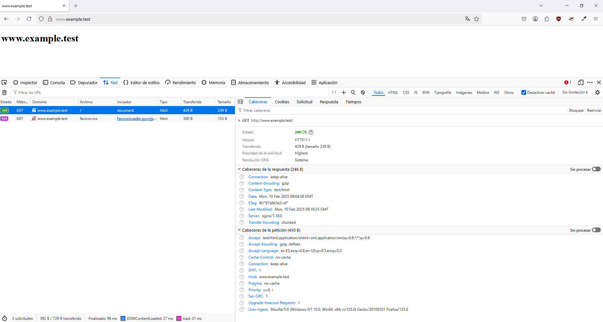
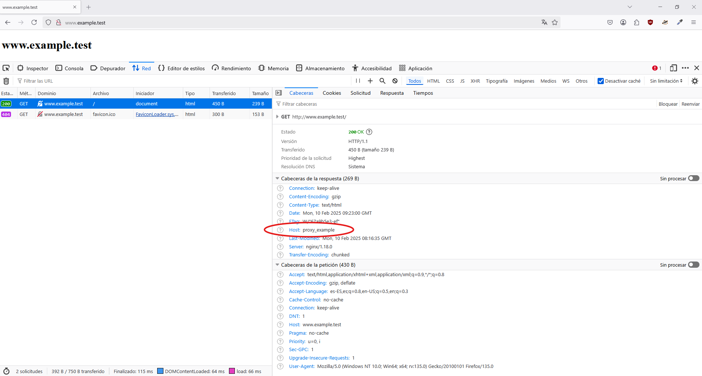
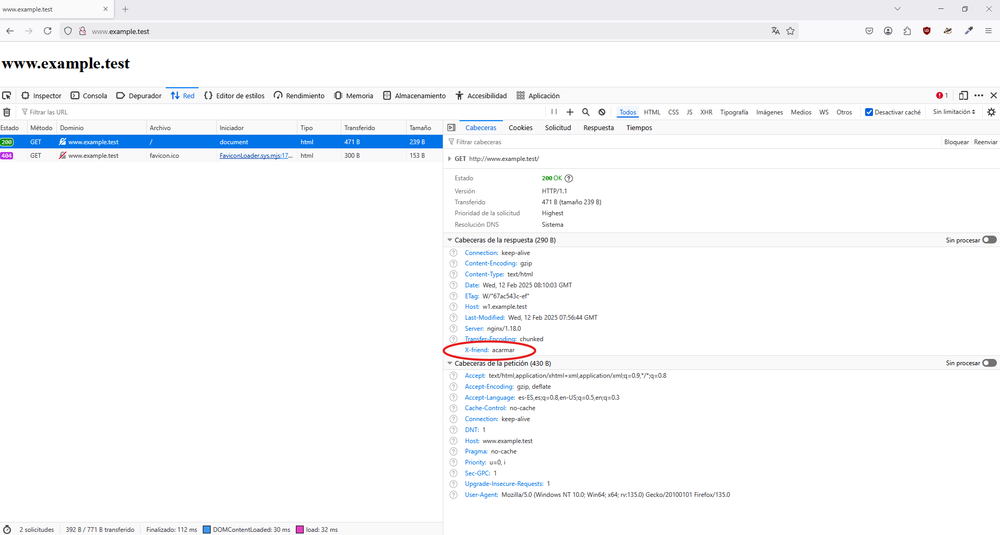
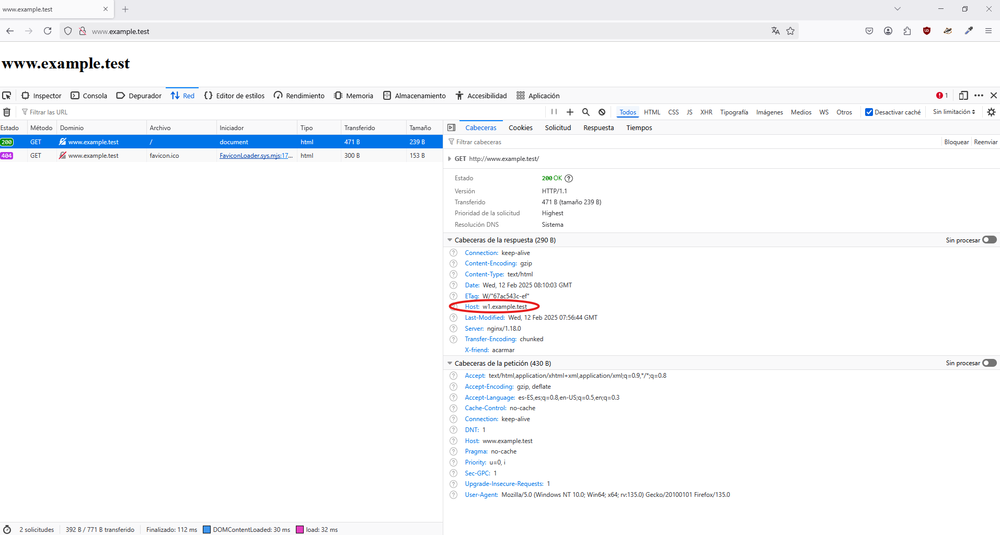

# Proxy Inverso

## Contenidos

- [Vagrantfile](#vagrantfile)  
- [Configuración de la máquina web](#configuración-de-la-máquina-web)  
- [Configuración del proxy](#configuración-del-proxy)  
- [Herramientas de desarrollador](#heramientas-de-desarrollador)  
- [Añadir cabeceras al proxy inverso](#añadir-cabeceras-al-proxy-inverso)  

## Vagrantfile:

`vagrant init -m debian/bullseye64`

Se edita Vagrantfile:  
```Vagrantfile
Vagrant.configure("2") do |config|
  config.vm.box = "debian/bullseye64"
  config.vm.provider "virtualbox" do |vb|
    vb.memory = "256"
  end # virtualbox

  # Provisión común
  config.vm.provision "shell", inline: <<-SHELL
    apt-get update && apt-get install -y nginx
  SHELL

  # Proxy
  config.vm.define "proxy" do |p|
    p.vm.hostname = "www.example.test"
    p.vm.network "public_network"
    p.vm.network "private_network", ip: "192.168.57.10"
  end # proxy

  # Web
  config.vm.define "web" do |w|
    w.vm.hostname = "w1.example.test"
    w.vm.network "private_network", ip: "192.168.57.11"
  end # web
end
```

`vagrant up`

En el caso de la máquina *web* solo aparecerá el adaptador de red nat y en la máquina *proxy* habrá dos.  
Si pregunta *"Which interface should the network bridge to?"*, se escogerá la opción *Ethernet Connection*.

## Configuración de la máquina web

`vagrant ssh web`

`ip a`

Devolverá la ip 10.0.2.15

Se crea el directorio de la web y se le dan permisos:  
```bash
sudo mkdir -p /var/www/w1/html
sudo chown -R www-data:www-data /var/www/w1/
sudo chmod -R 755 /var/www/w1/html/
```

`ls /etc/nginx/sites-available`  
Devolverá que solo existe el fichero default

`sudo nano /etc/nginx/sites-available/w1`  
Se añade el contenido del fichero w1

Se crea el enlace simbólico  
`sudo ln -s /etc/nginx/sites-available/w1 /etc/nginx/sites-enabled/`

Se desactiva/borra el sitio por defecto  
`sudo rm /etc/nginx/sites-enabled/default`

Se añade la página de prueba index.html y su contenido:  
`sudo nano /var/www/w1/html/index.html`

Comprobación de errores:  
`sudo nginx -t`

Se reinicia el servicio:  
`sudo systemctl restart nginx`

Instalación de curl:  
`sudo apt-get install -y curl`

Se prueba el curl:  
`curl http://localhost:8080`  
`curl http://w1.example.test:8080`


## Configuración del proxy

`vagrant ssh proxy`  
`ip a`

o en un solo comando `vagrant ssh -c "ip a" proxy`

Se crea un backup del archivo default:  
`sudo cp /etc/nginx/sites-available/default /etc/nginx/sites-available/default.bak` 

Se suprime el archivo original:  
`sudo rm /etc/nginx/sites-available/default`

Se vuelve a crear y se añade el contenido nuevo:  
`sudo nano /etc/nginx/sites-available/default`

Comprobación de errores:  
`sudo nginx -t`

Se reinicia el servicio:  
`sudo systemctl restart nginx`

Se edita el fichero hosts:  
`sudo nano /etc/hosts`  
Se añade la línea:  
`192.168.57.11 w1.example.test w1`

Se edita el fichero *default* de *sites-enabled*:  
`sudo nano /etc/nginx/sites-enabled/default`
```bash
server {
    listen 80;
    listen [::]:80;

    server_name www.example.test;

    location / {
        proxy_pass http://w1.example.test:8080;
    }
}
```

Se reinicia el servicio:  
`sudo systemctl restart nginx`

En la parte de cliente Windows habría que editar el fichero *C:\Windows\System32\drivers\etc\hosts* añadiendo la siguiente línea:  
`10.108.69.1 www.example.test`  
(En este caso es la dirección ip pública que se genera con la máquina *proxy*, se mantiene solo un tiempo)



## Heramientas de desarrollador

Ver el tráfico:  
`vagrant ssh -c "sudo tail /var/log/nginx/access.log" web`  
`vagrant ssh -c "sudo tail /var/log/nginx/access.log" proxy`

Desde las herramientas de desarrollador del navegador, en *Red*, se habilita la opción *Desactivar caché*:  


## Añadir cabeceras al proxy inverso

`vagrant ssh proxy`

`sudo nano /etc/nginx/sites-enabled/default`  
En *location* se añade:  
`add_header X-friend acarmar;`  
proxy_set_header Host $host;

Se reinicia el servicio:  
`sudo systemctl restart nginx`



## Añadir cabeceras al servidor web

`vagrant ssh web`

`sudo nano /etc/nginx/sites-enabled/w1`  
En *location* se añade:  
`add_header Host w1.example.test;`  
proxy_set_header Host $host;

Se reinicia el servicio:  
`sudo systemctl restart nginx`

